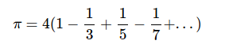
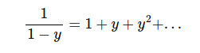
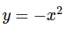
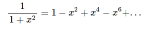
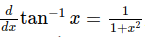
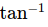
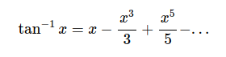
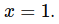
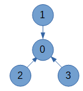
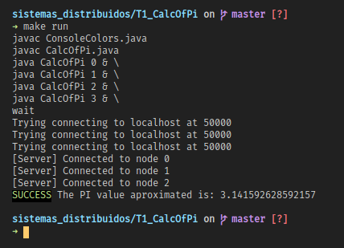

# Tarea 1 | Cálculo distribuido de PI
## Introducción
En esta tarea se va a desarrollar un programa distribuido que calculará una aproximación de PI utilizando la serie de `Gregory-Leibniz`.

### Demostración de la serie Gregory-Leibniz:
Comenzando con la serie de Taylor:

Aplicamos la sustitución  para obtener:

Ahora, ya que , integramos, encontramos que la expansión de Taylor para  es:

Finalmente, encontramos la formula sustituyendo 

## Arquitectura del programa
El programa se va a ejecutar sobre cuatro nodos, cada nodo será una computadora diferente. Cada nodo (incluso el nodo 0) deberá calcular 10 millones de términos de la serie. Implementaremos la siguiente topología lógica de tipo estrella, cada nodo se ha identificado con un número entero:

El nodo 0 actuará como servidor y los nodos 1, 2 y 3 actuarán como clientes.

Dado que el requerimiento es desarrollar un solo programa, será necesario pasar como parámetro al programa el número de nodo actual, de manera que el programa pueda actual como servidor o como cliente, según el número de nodo que pasa como parámetro.

## Capturas

